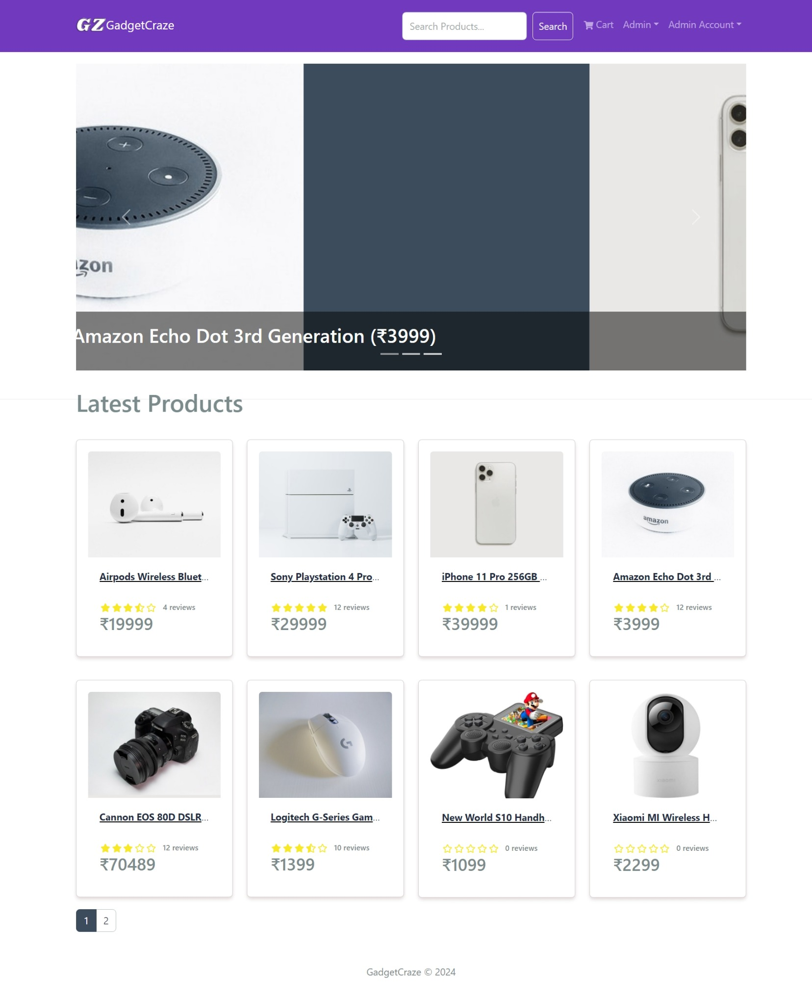
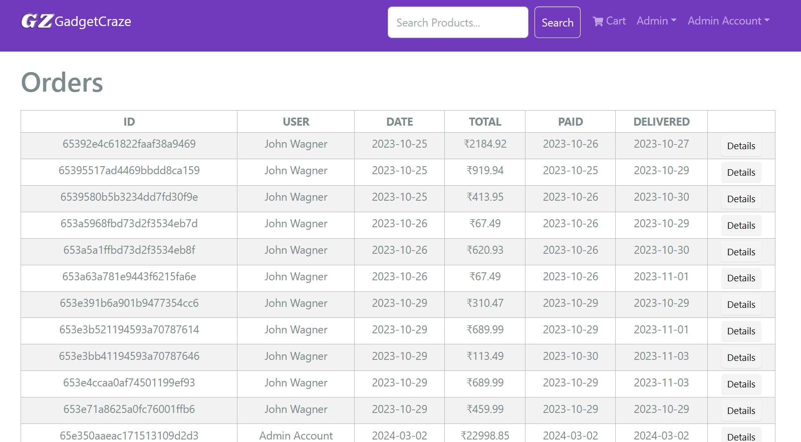
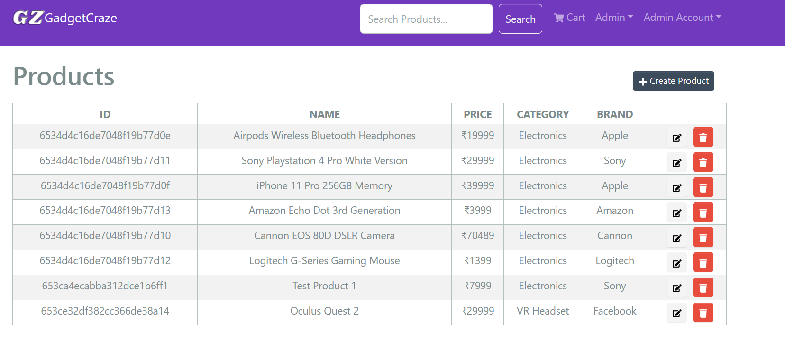
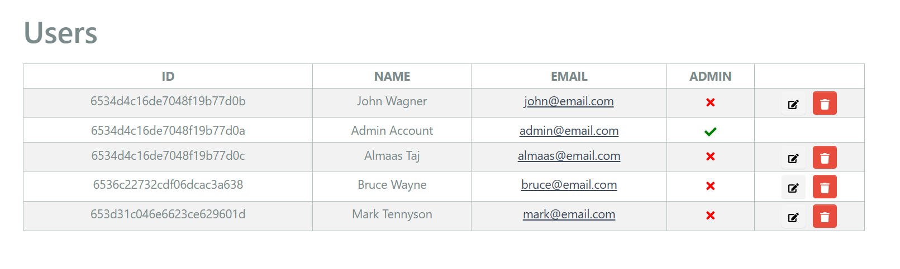

# GadgetCraze

This Repo contains **source code** for an E-commerce Website named [GadgetCraze](https://gadgetcraze-v1.onrender.com/) which was created using **MERN Stack**.

# Demo Video
https://github.com/user-attachments/assets/c23da8ec-f288-4da1-a852-0be4a9a59a1d

# HomePage



# HomePage Structure


## ProductList


# Features

1.  Full featured shopping cart
2.  Product reviews and ratings
3.  Top products carousel
4.  Product pagination
5.  Product search feature
6.  User profile with orders
7.  Admin product management
8.  Admin user management
9.  Admin Order details page
10. Mark orders as delivered option (Admin)
11. Checkout process (shipping, payment method, etc)

# Product Page


## Product Description


## Write A Review


## Customer Reviews


## Shopping Cart Page


## Shipping


## Payment Selection


## Place Order


## Order Summary


## After Payment


## After Delivery


## User Profile Page


# Admin Functionality

## Admin Order Detail Screen



## Admin Product Management Screen



## Admin User Management Screen



## How to use this Repo

-   Add `.env` file with variables defined in `.env.example` file
-   **Install Dependencies (frontend & backend)**

```
npm install
cd frontend
npm install
```

-   **Run**

```
# Run frontend (:3000) & backend (:5000)
npm run dev

# Run backend only
npm run server
```

-   **Build & Deploy**

```
# Create frontend prod build
cd frontend
npm run build
```

# Sample Users

```
Sample User Logins
test@email.com (Customer)
123456

john@email.com (Customer)
123456
```
